**<h1 align="center">Welcome to Feedy UI 👋</h1>**

<p align="center">

</p>
<p>
  
  <a href="https://feedyui.netlify.app/documentation/documentation.html" target="_blank">
    
  </a>
  <a href="https://twitter.com/_mr_debugger_" target="_blank">
    
  </a>
</p>

## ✨ [Feedy UI](https://feedyui.netlify.app/documentation/documentation.html)

> FeedyUI is a lightweight, reliable and fast component library build with HTML, CSS and Javascript.

<br>

## **Getting Started**

In order to start using the component library, you simply need to include the library's CSS file in your local html file as follows:

```html
<link rel="stylesheet" href="https://feedyui.netlify.app/library/lib.css" />
```

Or if you want to simply use the library inside a CSS file the following can also be done,

```css
@import url("https://feedyui.netlify.app/library/lib.css");
```

<br>

## **Systems**

- ## [Colors](#colors)

- ## [Grid](https://feedyui.netlify.app/documentation/documentation.html#grid-iframe)


- ## [Typography](https://feedyui.netlify.app/documentation/documentation.html#typography-iframe)


<br>

## **Components**

- ## [Alert](https://feedyui.netlify.app/documentation/documentation.html#alert-iframe)

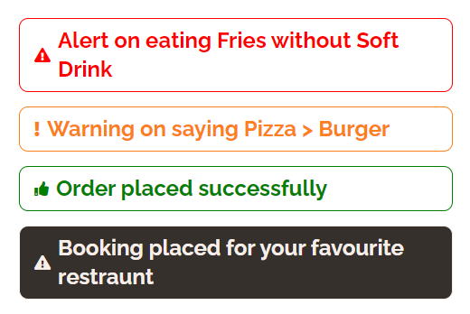

- ## [Avatar](https://feedyui.netlify.app/documentation/documentation.html#avatar-iframe)

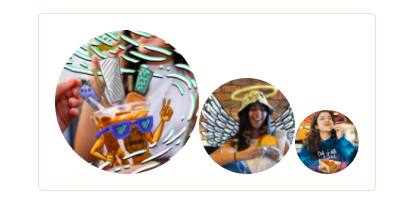
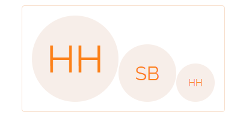

- ## [Badge](https://feedyui.netlify.app/documentation/documentation.html#badge-iframe)

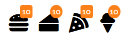
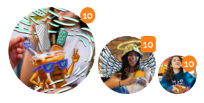

- ## [Button](https://feedyui.netlify.app/documentation/documentation.html#button-iframe)

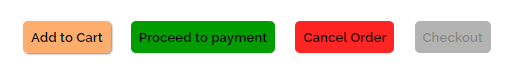
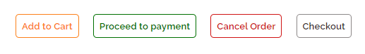
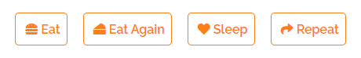

- ## [Card](https://feedyui.netlify.app/documentation/documentation.html#card-iframe)

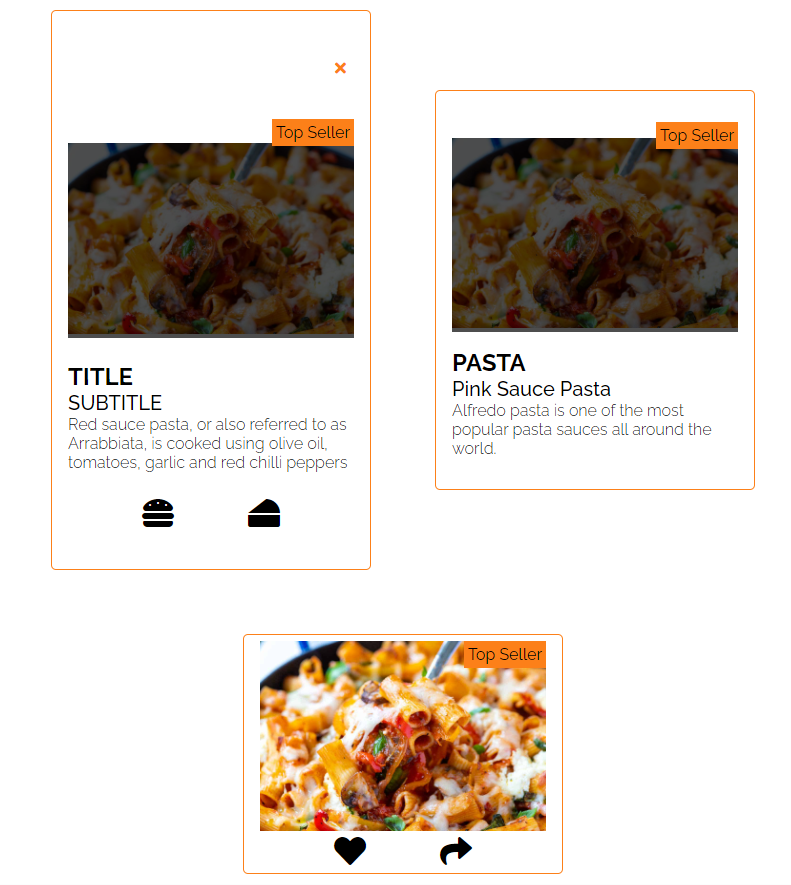
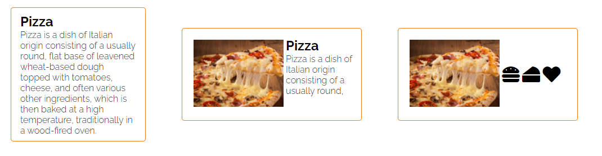

- ## [Image](https://feedyui.netlify.app/documentation/documentation.html#image-iframe)

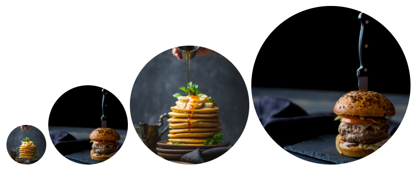
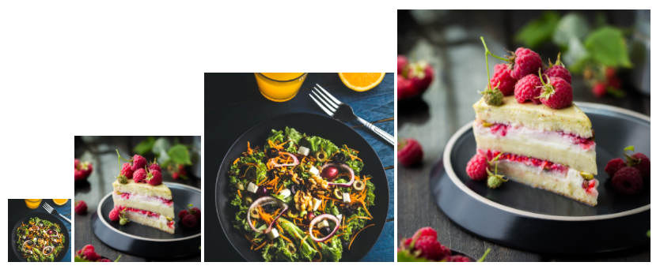

- ## [Input](https://feedyui.netlify.app/documentation/documentation.html#input-iframe)

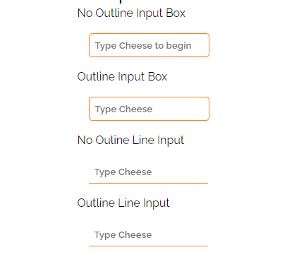
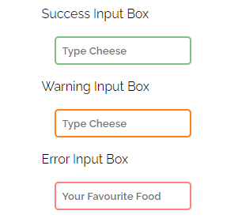

- ## [List](https://feedyui.netlify.app/documentation/documentation.html#list-iframe)

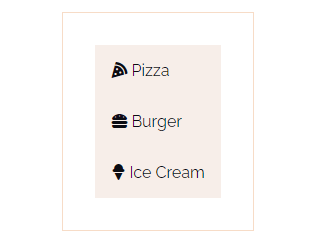
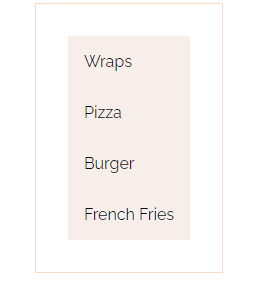

- ## [Tabs](https://feedyui.netlify.app/documentation/documentation.html#nav-iframe)

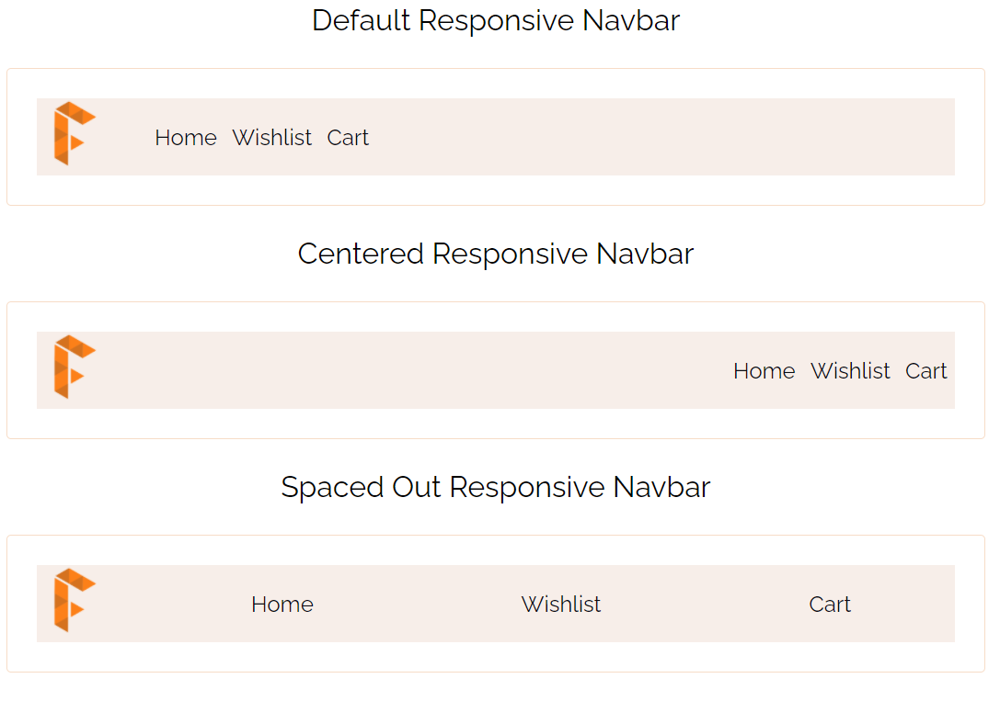

- ## [Rating](https://feedyui.netlify.app/documentation/documentation.html#rating-iframe)


- ## [Snackbar](https://feedyui.netlify.app/documentation/documentation.html#snackbar-iframe)

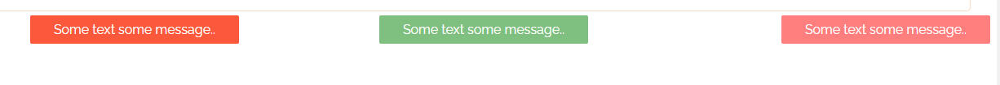

## Author

👤 **Humza Hasan**

- Website: https://dev.to/thehumzahasan
- Twitter: [@\_mr_debugger\_](https://twitter.com/_mr_debugger_)
- Github: [@humzahasan](https://github.com/humzahasan)

## Show your support

Give a ⭐️ if this project helped you!
